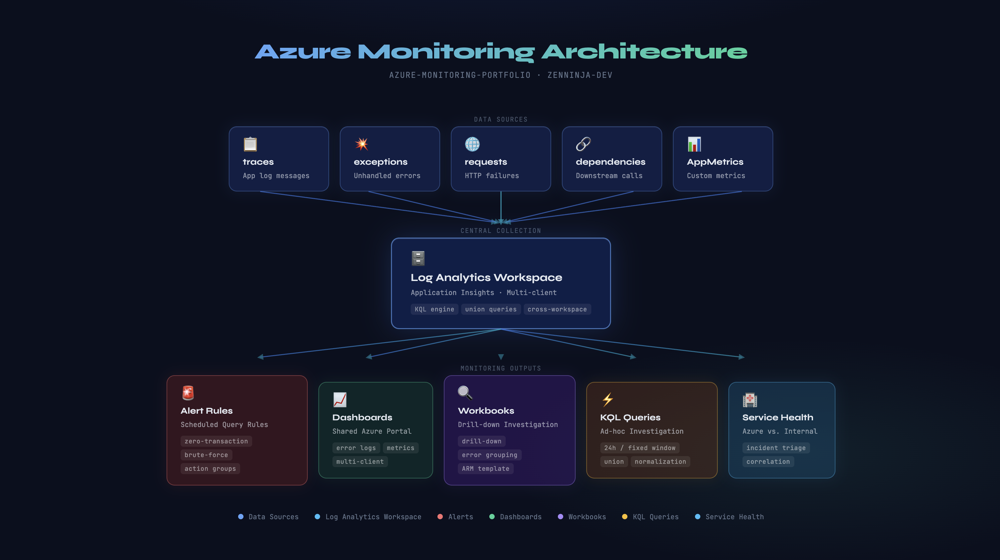
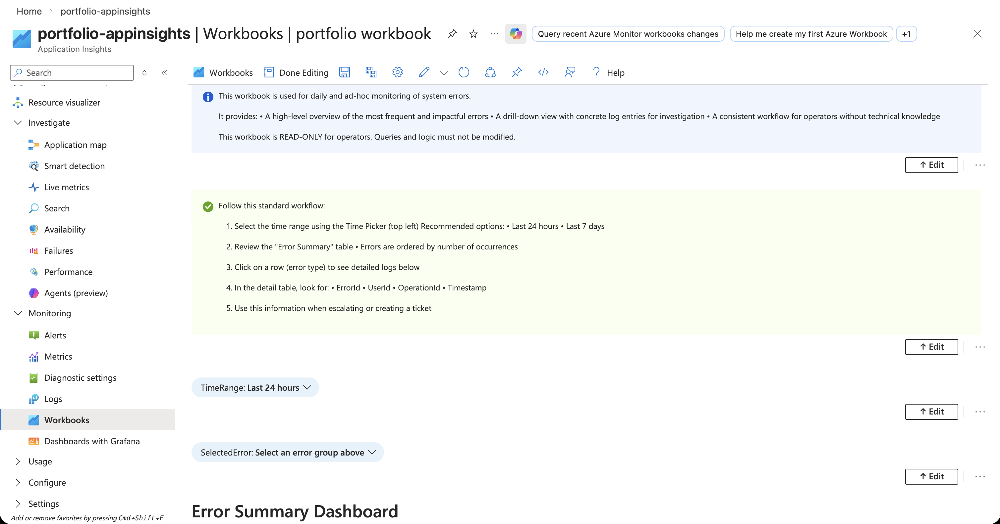
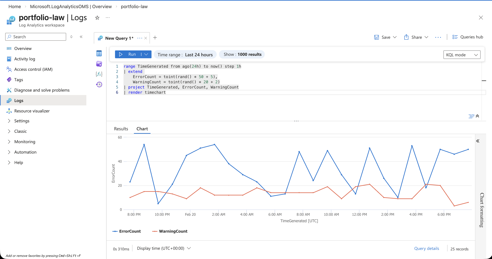
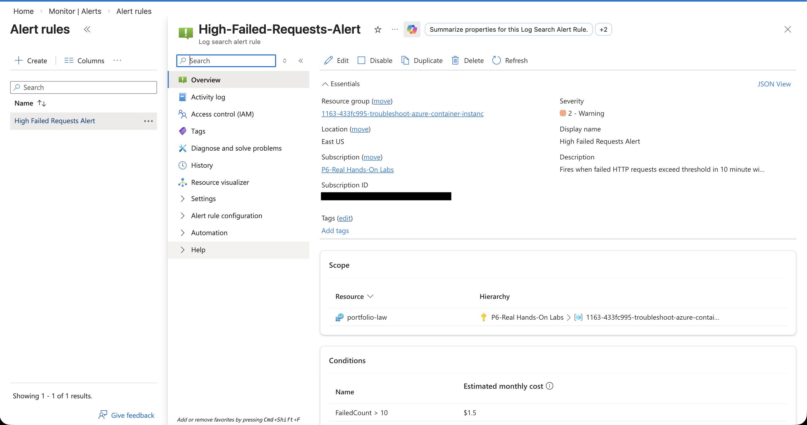

# Azure Monitoring Portfolio

> Personal learning portfolio focused on Azure Monitor, Log Analytics, KQL and Security Dashboarding.  
> Built as part of my journey toward Cloud Security Engineering.

---

## Architecture Overview



The monitoring setup collects data from four Application Insights sources — `traces`, `exceptions`, `requests` and `dependencies` — into a central Log Analytics Workspace. From there, KQL queries power alerts, dashboards, workbooks and ad-hoc investigations across multiple client environments.

---

## About This Repository

This repository documents my hands-on experience and learning in Azure monitoring and security observability.  
All content is based on personal lab work and anonymized knowledge from real-world experience.

**Focus areas:**
- Azure Monitor & Log Analytics Workspace
- KQL (Kusto Query Language) for security and operational investigations
- Custom Dashboards & Workbooks for incident response
- Alert rules and automated responses
- Operational documentation and team knowledge sharing

---

## Repository Structure

```
azure-monitoring-portfolio/
├── kql-queries/
│   ├── authentication-and-identity.md        # Identity threat detection queries
│   ├── application-and-system-monitoring.md  # App health and error monitoring
│   └── full-log-investigation.md             # Incident investigation queries (24h and fixed window)
│
├── workbooks/
│   ├── drill-down-logs-workbook.json         # Drill-down error investigation workbook (ARM template)
│   └── workbooks_README.md
│
├── alerts/
│   ├── security-alerts.md                    # KQL-based security alert rules
│   ├── application-alerts.md                 # Application health alert rules
│   └── alert-zero-transactions.json          # Zero transaction outage alert (ARM template)
│
├── dashboards/
│   ├── error-logs-dashboard.json             # Multi-client error log monitoring dashboard
│   ├── metrics-investigation-dashboard.json  # Outage and drop investigation dashboard
│   └── azure-health-vs-metrics-dashboard.json  # Azure Service Health vs. internal metrics
│
├── automation/
│   ├── deploy-workbooks.sh                   # Bash script – deploys workbook to 30+ environments via Azure CLI
│   ├── systems.csv                           # Target environments list (systemName, resourceGroup, appInsightsId)
│   ├── workbook-template.json                # ARM template used by the deployment script
│   └── README.md
│
└── docs/
    ├── architecture-diagram.png              # Monitoring architecture overview
    ├── screenshot-kql-query.png              # KQL query with timechart in Log Analytics
    ├── screenshot-alert-rule.png             # Deployed alert rule in Azure Monitor
    ├── screenshot-workbook.png               # Drill-down workbook in Application Insights
    ├── alert-response-guide.md               # Alert triage and response workflow
    ├── docs-azure-monitoring-dashboards.md   # Dashboard usage guide with KQL examples
    └── docs-azure-specific-monitoring.md     # Customer and environment metrics guide
```

---

## Highlights

### 🔍 Drill-down Log Investigation Workbook



Investigates errors across `traces`, `exceptions`, `requests` and `dependencies` in a single union query. Operators click any error group in the summary table to instantly drill down into individual log entries with full context — ErrorId, OperationId, timestamp, system name and environment. Built for non-technical operators during live outages.

---

### ⚡ KQL Queries in Log Analytics



Multi-source union queries with error normalization and grouping. Available in 24h rolling window and fixed time window variants. Used for post-incident analysis and root cause investigation across multiple environments simultaneously.

---

### 🚨 Alert Rules via ARM Templates



Scheduled Query Rules deployed via ARM templates for repeatable infrastructure setup. Covers zero-transaction outage detection, brute-force login attempts and application error rate spikes. Severity levels and evaluation windows configured per alert type.

---

### 🤖 Automated Multi-Environment Workbook Deployment

Instead of manually deploying workbooks to 30+ client environments one by one, a single bash script handles the entire rollout via Azure CLI and ARM templates. The script reads a CSV list of target environments, deploys the workbook template to each resource group, logs success/failure per system and exits with a non-zero code on failure – making it safe for CI/CD pipelines.

This reduced deployment from hours of manual work to a single command.

---

### ☁️ Azure Health vs. Metrics Dashboard

Correlates Azure Service Health status with internal transaction metrics on a single screen. Created to answer the key incident question immediately: *is this our problem or Microsoft's?* Eliminates the need to switch between portals during active incidents.

---

## Skills Demonstrated

| Area | Tools & Skills |
|------|---------------|
| Log querying | KQL, Log Analytics Workspace, Application Insights |
| Incident investigation | Multi-source union queries, drill-down workbooks |
| Visualization | Azure Workbooks, Custom Dashboards |
| Alerting | Scheduled Query Rules, Metric Alerts, ARM templates |
| Service monitoring | Azure Service Health, multi-client monitoring |
| Documentation | Operational guides, team knowledge sharing |
| Automation | Bash scripting, Azure CLI, multi-environment ARM deployment |

---

## Status

🔨 Active learning – content added continuously

---

*ZenNinja-Dev | Aspiring Cloud Security Engineer*
